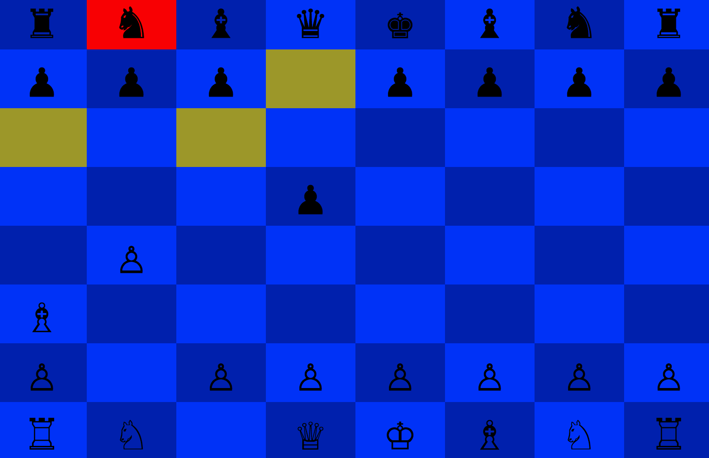

#Chess

This is a two-player chess console game built using Ruby. To play,
download the file, then open up your terminal and run this line:

`ruby game.rb`

Use the arrow keys to move the cursor. Press enter to select a piece to move. Move the cursor to the position you want to move the piece to and press enter again. The yellow highlighting on the board indicates the locations available for the piece.

###Code Highlights
* I wrote an algorithm that checks for the validity of a player's move. The move is valid only if it does not place the king in check.

<pre><code>
def move_into_check?(to_pos)
  board_copied = board.dup
  board_copied.move_piece!(pos, to_pos)
  board_copied.in_check?(color)
end

def valid_moves
  self.moves.select do |move|
    !self.move_into_check?(move)
  end
end
</pre></code>

* The different pieces in the game inherit from the Piece class so that the code remains DRY.

<pre><code>
class Piece
  attr_reader :color, :board
  attr_accessor :pos

  def initialize(color, pos, board)
    @color = color
    @pos = pos
    @board = board
  end

  def present?
    true
  end

  def to_s
    " x "
  end
  ...
end

class Pawn < Piece
  ...
end
</pre></code>

* The logic of similar piece classes are placed in modules. For example, the queen, bishops, and rooks can slide, so I built a module called Slidable.

<pre><code>
module SlidingPiece
  #bishop, rook, queen

  DIAG_MOVES_DIRC = [[1,1],[1,-1],[-1,1],[-1,-1]]
  NORMAL_MOVES_DIRC = [[1,0],[-1,0],[0,1],[0, -1]]

  def diag_moves_dirc
    DIAG_MOVES_DIRC
  end

  def normal_moves_dirc
    NORMAL_MOVES_DIRC
  end

  def moves
    moves = []
    moves_dirc.each do |dirc|
      new_pos = self.pos
      new_pos = add_pos_dirc(new_pos, dirc)
      until !board.in_bounds?(new_pos)
        if !board.occupied?(new_pos, self.color)
          moves << new_pos
          new_pos = add_pos_dirc(new_pos, dirc)
        else
          new_pos = [100, 100]
        end
      end
    end
      moves
  end

  def add_pos_dirc(pos, dirc)
    [pos.first + dirc.first, pos.last + dirc.last]
  end

end
</pre></code>
